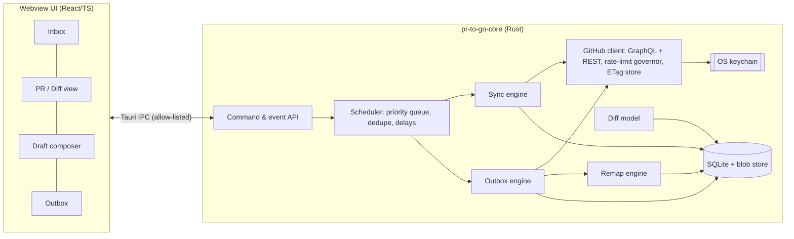
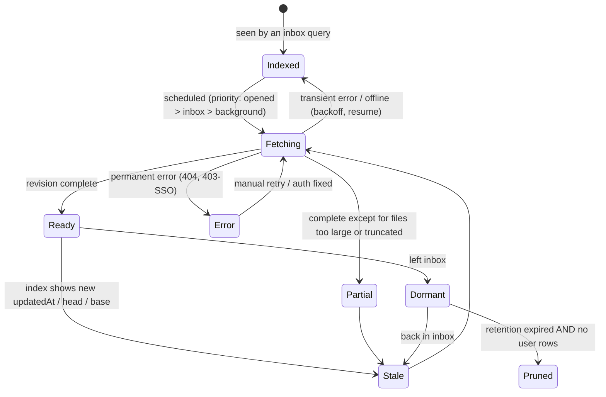
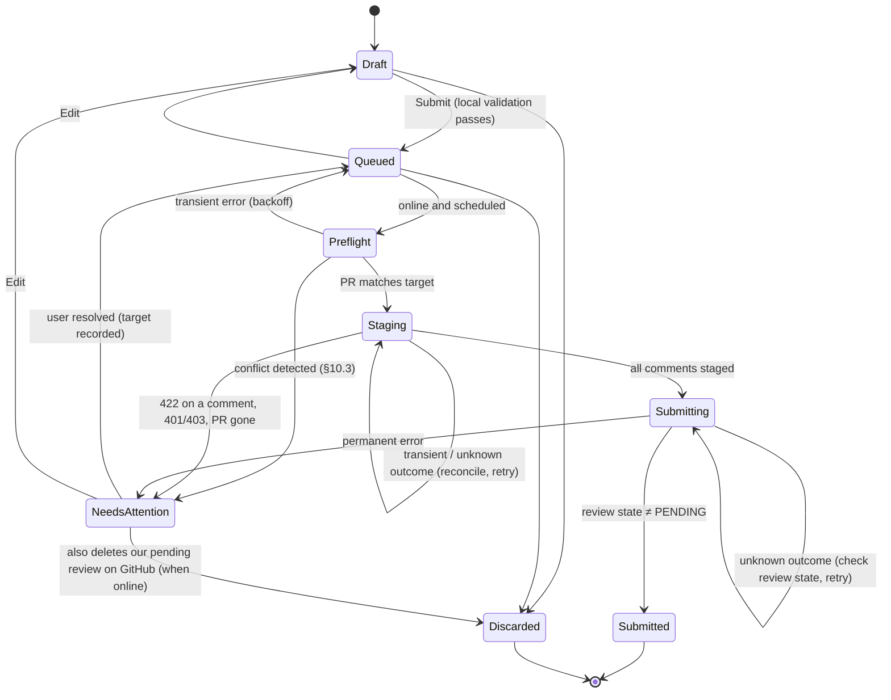

# PR to Go: Design

**Status:** Approved, and built in Phase 2. §15 records what exists, where
the code differs from this document, and what's still open. · **Date:**
2026-09-23

PR to Go is a desktop app for reviewing GitHub pull requests offline. You sync
PRs while you have a connection. You review them offline in a full diff viewer.
Your comments and verdicts wait in a local outbox and are posted to GitHub when
you reconnect.

This document covers:

1. What we learned from the two closest existing tools (Hubtty and prr).
2. The edge cases v1 will handle.
3. The tech stack, with its tradeoffs.
4. The local data model.
5. The sync and outbox state machines.
6. How we'll test it and in what order we'll build it.

Section 14 lists the decisions we asked for (all approved as recommended).

---

## 0. Summary

- **Stack:** Tauri 2. A Rust core does all storage, GitHub access, sync, the
  outbox and comment remapping. A TypeScript/React UI runs in the system
  webview. The core has no UI dependencies, so a later iPad app can reuse it
  (through Tauri's iOS target, or through Swift bindings).
- **Storage:** One SQLite database, plus a store of file contents keyed by
  their git blob ID. Data mirrored from GitHub and data the user wrote live in
  separate tables. **Sync never deletes or rewrites anything the user wrote.**
  Hubtty breaks this rule: we confirmed that a force-push in Hubtty silently
  deletes a queued review and its draft comments (§1.1.4).
- **Diffs:** We show GitHub's own per-file patch, so the lines you can comment
  on are exactly the lines GitHub will accept. Full file contents at the base
  and head commits are stored, so you can expand context offline. The base is
  the true merge base. Hubtty uses the first commit's parent, which is wrong
  when the PR has merged in its base branch.
- **No git clones in v1.** File contents come from the API and are checked
  against their git hash. Git mirrors become an optional backend later
  (decision D2).
- **Submission:** Each queued review becomes exactly one GitHub review. We
  build it as a *pending* review (visible only to you), add all comments to
  it, then submit it. Every step saves the returned server ID before moving
  on, and a step with an unknown outcome is checked against the server before
  it is retried. Crashes and timeouts therefore don't create duplicate
  reviews.
- **Head moved while offline:** Before submitting, we re-fetch the PR. If it
  changed, the review pauses in a **Needs attention** state. It shows what
  moved and proposes a new line for each comment; you remap, keep or drop
  each one. An approval never silently carries over to code you haven't seen.

---

## 1. Prior art

### 1.1 Hubtty

Hubtty is a Python terminal UI (urwid, SQLAlchemy, SQLite), forked from Gertty
(a Gerrit client). It's licensed Apache-2.0. We read
`hubtty/sync/**`, `hubtty/db.py`, `hubtty/gitrepo.py` and the diff and PR
views, at commit `178ef72` (2026-07-06).

#### 1.1.1 How the sync engine works

- **Task queue.** A single thread works through an in-memory queue with three
  priority levels (`sync/queue.py`). The queue drops duplicate tasks, promotes
  a duplicate to a higher priority when needed, and supports delayed tasks.
  Tasks are dataclasses whose fields define their identity, so
  "sync PR o/r#5" is never queued twice. A task can queue a follow-up task.
  Periodic work runs every 60 seconds (subscribed repos) and every hour
  (pruning, catching up on PRs marked out of date).
- **Incremental polling.** It uses the search API with
  `type:pr updated:>{last_sync - 4s}` for each group of up to 10 repos. The 4
  seconds cover clock skew. The search API returns at most 1000 results;
  Hubtty detects when it hits that cap and then queries each repo separately.
- **PR sync** (`tasks/pull_request.py`). It makes REST calls for the PR, its
  commits, review comments, reviews and issue comments. It only fetches
  details for commits it hasn't seen (commits never change). Inside one DB
  session it upserts the PR, commits, files, messages, approvals and comments,
  deletes commits that are no longer in the PR, and runs `git fetch
  pull/N/head` into a **full local clone of every subscribed repo**. If a sync
  fails, the PR is marked `outdated` and retried every hour.
- **HTTP.** ETag conditional requests (a 304 costs nothing against the rate
  limit), but the ETag cache is **in memory only**. It follows `Link`
  pagination. On a primary rate limit it waits for `retry-after` or
  `x-ratelimit-reset`. On a secondary rate limit it backs off exponentially
  (60 s doubling to 600 s) and gives up after 5 tries. It recognizes the error
  an org returns when it restricts OAuth app access.
- **CI checks.** When a PR's checks are pending, it schedules a lightweight
  task that fetches only the checks, backing off from 30 s to 300 s, up to 20
  times.

#### 1.1.2 How offline actions are queued and replayed

- **The database is the outbox.** Things waiting to upload are rows with flags:
  a `message` with `pending=True`, `comment.draft=True`, `approval.draft=True`,
  and `pending_labels`, `pending_rebase`, `pending_edit` and `pending_merge` on
  the PR. `UploadReviewsTask` scans for these at startup and after every
  dropped connection (it's queued when the connection drops and runs once
  it's back). **We borrow this:** the durable record is the
  source of truth, and the in-memory queue only schedules work.
- **Offline detection.** A connection error, a 5xx, a rate limit or a read
  timeout marks the app offline. It sleeps (30 s, or the rate-limit backoff)
  and retries the same task. While offline, `submitTask()` **discards** new
  tasks. That's safe only because of the rescan on reconnect.
- **Uploading a review** (`tasks/upload.py`). The HTTP POST happens **inside
  the DB session**, with the process-wide DB lock held. The idea is that a
  failed POST rolls back the local deletes. The costs:
  - The UI thread is blocked on the lock for as long as the network call
    takes.
  - It posts **one review per commit that has comments** (a leftover from
    Gerrit patch sets). If the second POST fails, the rollback restores the
    comments that the first POST already posted, so the retry posts them
    again.
  - A read timeout after the server has already accepted the POST is
    treated as "offline, retry", which also posts twice.
- **What it can't express.** Each comment has only `line` and `side=LEFT`.
  There are no multi-line ranges, no replies (`TODO(mandre) add ability to
  reply`), no file-level comments and no suggestions. It also ignores your own
  pending reviews started on github.com (`TODO(mandre) sync pending reviews`).

#### 1.1.3 How PRs updated during a pending review are handled

- **The "held" flag.** Suppose you drafted an approval, and someone else then
  requested changes. Sync sets `pr.held = True`, and uploads for that PR stop
  until you clear the flag by hand. `UploadReviewTask` runs a PR sync just
  before uploading, specifically to catch this. **We borrow the idea and
  broaden it** into our pre-submit check (§10.3).
- **No remapping of drafts.** A draft comment is stored as
  `(file row of the commit you were viewing, line number)`. It isn't
  re-anchored when that commit changes.

#### 1.1.4 How comments are mapped to lines when the diff changes

- **Existing comments.** Hubtty relies on GitHub's own re-anchoring. Every
  sync overwrites `comment.commit_id` and `comment.line` with GitHub's
  current values. A comment whose `line` is null (outdated) isn't shown in the
  diff. It appears in the PR view, listed under its review, with
  `original_commit_id` and `original_line`.
- **Draft comments are lost on force-push.** This is the most important
  finding. `Commit → files → comments` and `Commit → messages` are set to
  `cascade='all, delete-orphan'`. When a sync finds a commit that is no longer
  in the PR, it deletes the commit, and the cascade deletes the draft review
  message and the draft comments with it. The pre-upload sync described above
  triggers this path too. We confirmed it with Hubtty's own ORM mappings in a
  scratch script:
  - Before the force-push: `messages 1, comments 1`.
  - After: `messages 0, comments 0, pending messages 0`.

  Hubtty's test suite has no force-push tests.

#### 1.1.5 Gerrit leftovers vs. GitHub-native parts

| Gerrit-era leftover | How it fits GitHub |
|---|---|
| `commit` rows, each with its own `file` rows, and comments attached to a commit's file (Gerrit patch sets) | GitHub reviews are against the whole-PR diff (merge base → head) |
| `approval` for each (account, sha), with a `draft` flag (Gerrit label votes) | GitHub has review states, dismissals and "latest review per user" |
| `message` used for both reviews and issue comments; IDs from two separate ID spaces share one column, which isn't unique | Reviews, review comments and issue comments are different objects |
| `comment.parent` boolean ("comment on parent") | Maps to `side=LEFT` |
| Related changes found through commit parents (`getCommitsByParent`) | Gerrit dependency chains; not meaningful inside one PR |
| `/COMMIT_MSG` pseudo-file and commit context in diffs; topics; Gerrit-style search language; `held`, `reviewed`, `hidden` and `starred` flags; `pending_rebase` and `pending_merge` | Local UI conventions and Gerrit actions |

**GitHub-native parts worth borrowing:** labels, the check-run and status
model with re-polling of pending checks, the draft-PR flag, the rate-limit
handling, ETags, the fallback for search truncation, detection of OAuth
restrictions, and checking whether a file is generated (from
`.gitattributes` `linguist-generated` plus patterns in the config).

### 1.2 prr

prr is a Rust CLI, licensed **GPL-2.0**. It downloads a PR's diff into a
"review file". You quote-reply to it in your editor, and prr posts the result
as one review.

- **Format.** The top of the file is the review summary. `@prr approve`,
  `@prr reject` or `@prr comment` sets the verdict. A comment typed after a
  diff line is an inline comment. A blank line before a diff line starts a
  multi-line range. A comment typed after a `diff --git` header is a
  file-level comment. `[...]` hides quoted lines you don't need.
- **Tracking what was reviewed.** It stores the original diff and the head
  SHA from download time in a hidden metadata file. It detects when you've
  edited a quoted line. It refuses to re-download over a review you haven't
  submitted unless you pass `--force`.
- **Submission.**
  - `POST /pulls/{n}/reviews` with `commit_id` set to the SHA stored at
    download time, `line`/`side` and `start_line`/`start_side` for ranges,
    and suggestions written as ` ```suggestion ` blocks.
  - File-level comments are sent afterwards, one by one, through
    `POST /pulls/{n}/comments` with `subject_type=file`. So they aren't
    atomic with the review.
  - It rejects ranges that cross hunks or files.
  - It treats malformed JSON from GitHub as success ("GH is known to send
    unescaped control characters").
- **What we borrow:**
  - The idea of pinning the review to the reviewed commit.
  - Storing the exact diff you reviewed.
  - Never overwriting unsubmitted work.
  - Restricting ranges to one hunk and one file.
  - Its model of left/right line locations.
- **What we do differently:**
  - File-level comments go into the same pending review, so they're part of
    the same single review.
  - We fetch the PR metadata and the diff in a consistent order. prr fetches
    them in two separate calls, so the head can move in between.
  - There's an outbox.
  - Replies to threads are supported. prr lists them as a TODO.

### 1.3 Licensing

- **Hubtty (Apache-2.0).** We may port code if we keep attribution and add a
  `NOTICE`. So far we only plan to reuse ideas, such as the backoff schedules,
  deduplicating priority queue, held rule and truncation fallback. All of them
  will be credited in the README.
- **prr (GPL-2.0).** Ideas only, **no code**, unless we license the project
  under GPL. We propose Apache-2.0 for PR to Go (decision D6).

---

## 2. Edge cases v1 will handle

This list is also the source for the test scenarios in §12. The ones marked ★
come directly from failures or TODOs found in the prior art.

**Syncing**

1. ★ A force-push while you have drafts. Sync keeps the reviewed revision and
   its file contents for as long as any draft refers to them. Drafts are never
   deleted.
2. ★ Diff base. We use the merge base (from `compare/{base}...{head}`), not the
   first commit's parent. This matters for PRs that merged their base branch
   in.
3. The base branch is changed to a different branch while the head stays the
   same. The diff changes even though the head didn't, so we compare the
   (merge base, head) pair, not just the head.
4. Partial sync on flaky Wi-Fi. A new revision only becomes visible once it is
   complete (all files and contents present). Until then, the previous
   complete revision stays on screen.
5. Captive portals on trains and planes. An HTML `200` or a redirect is not
   "online". We check connectivity with an authenticated `GET /rate_limit`
   and require a JSON response with GitHub's headers.
6. Large PRs:
   - GitHub leaves out the patch for very large files.
   - The files API lists at most 3000 files.
   - GraphQL returns a file's text truncated when it's large, and returns no
     text for binary files.

   The PR is marked **partially available offline**, with a reason for each
   file.
7. Non-UTF-8 files and CRLF line endings. Every file's contents are checked
   against its git blob hash. If the check fails, we fetch the raw bytes over
   REST instead.
8. Images in descriptions and comments.
   - Images uploaded to private repos use signed URLs that expire after a few
     minutes, so we download them in the same sync step that fetched the HTML.
   - External images go through GitHub's image proxy.
   - Video is shown as a link.
9. ★ The 1000-result search cap. Repo subscriptions don't use search. They
   page through `pullRequests(orderBy: UPDATED_AT DESC)` and stop at the last
   timestamp we saw, comparing only server timestamps, so clock skew doesn't
   matter. Searches such as "review requested from me" use search and detect
   truncation.
10. ★ The ETag cache is persisted, so a laptop restart doesn't make every
    request count against the rate limit again.
11. A PR drops out of the inbox (it's closed, or you're no longer a
    requested reviewer). It stays locally while it has drafts or outbox items.
    Otherwise it's pruned after N days.

**The PR changes before we submit**

12. ★ The head moved (a new push or a force-push) → **Needs attention**, with
    proposed remaps.
13. ★ Someone requested changes after you drafted an approval. This is
    Hubtty's "held" rule → **Needs attention**.
14. The PR was closed, merged or locked, or the repo was archived. We say so
    and let you choose.
15. You already have a pending review on this PR, started on github.com.
    GitHub allows only one per user per PR. We offer to add your comments to
    it and never delete it.
16. The thread you're replying to was deleted. You can turn the reply into a
    new comment, move it into the summary, or drop it.
17. A suggestion's target lines changed. Its status is always "needs review",
    because a suggestion replaces the exact lines it was written against.
18. The head moves again while you're remapping. We re-check and ask again.

**Submitting**

19. ★ Timeouts after the server already committed the change, and crashes
    between steps. Server IDs are written down before the next step. Any step
    with an unknown outcome is checked against the server before retrying.
20. ★ One failed comment must not re-post the others. Each comment's staged
    ID is recorded, so only that comment's step is retried.
21. A `422` on one comment, for example because the line is no longer in the
    diff. The review goes to **Needs attention** and names that comment.
    Everything else stays staged.
22. Rules we check before queueing:
    - You can't approve or request changes on your own PR.
    - Request changes, and a comment review with no inline comments, both
      need a summary.
    - Suggestions only go on right-side (new code) lines.
    - Ranges must stay within one hunk.
23. Secondary rate limits. Changes are sent one at a time, at least 1 s
    apart, and `Retry-After` is honored. Line comments are batched into the
    call that creates the review, to stay under GitHub's limits on content
    creation.
24. The token expired or was revoked (`401`), or an org requires SAML SSO
    (`403` with `X-GitHub-SSO`). The review goes to **Needs attention**, the
    draft is untouched, and we link you to re-authorize.
25. Anything that can't be sent can be exported as Markdown, so text is never
    lost.

---

## 3. What the GitHub API constrains

We checked these against GitHub's public GraphQL schema
(`schema.docs.graphql`, fetched 2026-09-23).

- **One commit per review.** `addPullRequestReview` takes a single
  `commitOID`, and places the threads passed to it on that commit.
  `addPullRequestReviewThread` has no commit field; tested live, it places
  its thread on the PR's *current* head, whatever commit the review is for.
  **A single review can't anchor some comments to the old head and others to
  the new head.** "Keep this comment where it was" is therefore a choice for
  the whole review (§10.4), and a review of an older commit must send all its
  line comments in the call that creates it.
- **Batching line comments.** `addPullRequestReview(threads: [...])` accepts
  `line`, `side`, `startLine` and `startSide` for each thread. The older
  `comments` argument, which uses positions within the diff, is deprecated.
- **File-level comments** need `addPullRequestReviewThread` with
  `subjectType: FILE`. The batch thread input has no `subjectType`.
- **Replies.** `addPullRequestReviewThreadReply` takes an optional
  `pullRequestReviewId`, so replies can join our pending review.
- **Submit, delete, reconcile.** `submitPullRequestReview(event)` submits the
  review and `deletePullRequestReview` deletes it. Reviews and threads expose
  `state`, `isOutdated`, `line`/`originalLine`, `startLine`,
  `diffSide`/`startDiffSide`, `diffHunk` and `viewerCanReply`. That's enough
  to show outdated threads with their original context, and to reconcile
  after an uncertain step.
- **What GraphQL is missing:**
  - The merge base: use REST `compare`.
  - Per-file patch text: use REST `pulls/{n}/files`.
  - ETag caching.
  - Raw bytes for large or non-UTF-8 files: use REST `git/blobs/{sha}`.

  File contents that fit come from GraphQL `object(expression:)`, many per
  query.
- **Tested live** on 2026-09-24 against a throwaway repository.
  `crates/core/tests/live_write.rs` repeats these checks.
  - (a) Does the API accept a `commitOID` that a force-push has removed from
    the PR? **Yes.** The threads in the create call land on the old commit's
    lines, keep that commit, and don't show as outdated. A commit that was
    never part of the PR is refused (`VALIDATION`: "The commitOID is not part
    of the pull request").
  - (b) Does it accept line comments on expanded context lines outside the
    hunks? **No.** Only lines inside a hunk take comments. In the create
    call, one such line refuses the whole call (`UNPROCESSABLE`: "Line could
    not be resolved").
  - **`addPullRequestReviewThread` fails silently.** When it can't place a
    thread (a line outside the hunks, a file that isn't in the diff, a range
    that runs backwards), it answers `thread: null` without an error. The
    outbox treats that as a refusal. Before the live test it counted it as
    sent, so the comment was lost.
  - A range may span two hunks; our own rule (one hunk) is stricter. Empty
    bodies are accepted; we refuse them before queueing.
  - On a pending review, the *thread's* `startLine` is unreliable: it's set
    for single lines, and for a left-side line it's a right-side number. The
    *comment's* `startLine` is right, and it's what reconciling matches on.

---

## 4. Tech stack

### 4.1 Options

| | Offline storage | Diff rendering quality | Package size | Future iPad/mobile | Main risks |
|---|---|---|---|---|---|
| **Tauri 2** (Rust core + webview UI) | SQLite and the file store in the Rust core; the same code builds for iOS | Web stack: Shiki (VS Code grammars and themes) and a virtualized DOM. Excellent | ~10–20 MB | Tauri 2 has an iOS target; or bind the Rust core to SwiftUI (UniFFI) | Webview differences (WebKitGTK on Linux is slower); two languages |
| **Electron** (TypeScript everywhere) | better-sqlite3 (a native module); `safeStorage` for secrets (keytar is deprecated) | Same web stack, with the same Chromium everywhere. Excellent | ~90–150 MB download | None directly. Rebuild the shell in React Native or Capacitor; the TS core ports | Memory use and size; no mobile story for the shell |
| **Native** (SwiftUI + TextKit 2) | Core Data or GRDB | Diff view, highlighting (tree-sitter) and Markdown all built by hand. High effort | Smallest | Best iPad experience | macOS and iPad only; Windows and Linux need a second codebase |
| **Flutter** | drift/sqlite | Code highlighting and diff widgets are immature; editing code-heavy text on desktop is weaker | ~30–50 MB | Good | The diff viewer is the product, and it's the weakest area here |

### 4.2 Recommendation: Tauri 2 + Rust core + React/TypeScript UI

- **Offline storage and correctness** live in Rust. Behind a small API there's
  SQLite (`rusqlite`, bundled, WAL mode), the file store, the sync engine,
  the outbox and the remapper. That's the code that must be heavily tested and
  must survive crashes, and Rust's types help there. Secrets go in the OS
  keychain through the `keyring` crate. **The token never reaches the
  webview.**
- **Diff rendering** uses the best ecosystem available: Shiki, running in a
  Web Worker, highlights whole files so multi-line strings and comments are
  colored correctly inside hunks. (Hubtty merges whole-file syntax into its
  diffs the same way.) TanStack Virtual renders 10k-line diffs smoothly, with
  side-by-side and unified modes over the same row model.
- **Package size** is 10× smaller than Electron.
- **Mobile.** `pr-to-go-core` is a plain Rust library crate with no
  Tauri types, exposing async commands plus an event stream. An iPad app can
  use Tauri's iOS target, with a responsive UI reusing the React code, or bind
  the core into SwiftUI with UniFFI. Nothing in the core assumes git, a
  desktop filesystem layout or background daemons. That's one reason for no
  git mirrors in v1.
- **What we give up:** a single language, and a guaranteed Chromium on
  Linux. We accept both.

**Main libraries:**

- **Rust:** `tokio`, `reqwest` (rustls), `serde`, `rusqlite` +
  `rusqlite_migration`, `keyring`, `imara-diff` or `similar` (line diffs for
  remapping), `sha1` (checking git blob hashes), `tracing`; `axum` for the
  fake GitHub in tests; `insta` for snapshot tests.
- **UI:** React, Vite, TanStack Virtual, Shiki, `markdown-it` + GFM plugins
  (local previews of drafts), DOMPurify (GitHub HTML).

---

## 5. Architecture



- **Background work.** Sync and the outbox run as tokio tasks in the core.
  They keep going when the UI changes screens. The UI subscribes to events
  such as `pr.updated`, `sync.progress` and `outbox.changed`.
- **Database access.** There is one writer connection and one reader
  connection, each behind a lock. **A write transaction is never held across
  a network call:** we fetch first, then write in a short transaction. Hubtty
  holds its global lock across HTTP calls.
- **Untrusted content.** PR bodies and comments are attacker-controlled on
  public repos. The webview therefore uses:
  - DOMPurify on all GitHub HTML;
  - a strict CSP with no remote loads;
  - images and file contents served only from a local `prtg://` scheme;
  - Tauri's capability allow-list and isolation pattern;
  - external links opened in the system browser.
- **Authentication.** On first run you choose one of:
  - **Use the gh CLI token.** We run `gh auth token`, then copy the token
    into our own keychain entry and record that it came from `gh`. On a
    `401` we re-import it.
  - **Paste a PAT.** Classic or fine-grained.

  A test query checks the token's scopes and permissions, and lists anything
  missing (for example SSO authorization for an org). Tokens never touch
  SQLite, logs or the webview.

---

## 6. How we use the GitHub API

| Purpose | API | Notes |
|---|---|---|
| Inbox index (searches) | GraphQL `search(type: ISSUE)` | Node ID, `updatedAt`, `headRefOid` and `baseRefOid` only; detects truncation |
| Inbox index (repos) | GraphQL `repository.pullRequests(states: OPEN, orderBy: UPDATED_AT DESC)` | Stops paging at the last `updatedAt` we saw |
| PR metadata, reviews, threads, comments, issue comments, check summary | GraphQL, paginated connections | Nested pages kept small (Hubtty found GitHub struggles with large comment pages) |
| Merge base | REST `compare/{baseRefOid}...{headRefOid}` | With ETag; response is `merge_base_commit.sha` |
| Changed files + patches | REST `pulls/{n}/files` (100 per page, 3000 max) | With ETag; `patch` may be missing |
| File contents | GraphQL `object(expression:"<oid>:<path>") { ... on Blob { oid text isBinary isTruncated byteSize } }`, batched by count and byte budget | Fallback: REST `git/blobs/{sha}` (raw) |
| Images | HTTPS GET of the URLs in `bodyHTML` | Right after the HTML is fetched |
| Submission | GraphQL `addPullRequestReview`, `addPullRequestReviewThread`, `addPullRequestReviewThreadReply`, `submitPullRequestReview`, `deletePullRequestReview` | §10 |
| Connectivity check | REST `GET /rate_limit` | Doesn't count against the limit; also confirms the token works |

**The rate-limit governor**

- It tracks GraphQL `rateLimit { cost remaining resetAt }` and REST's
  `x-ratelimit-*` headers.
- It keeps a reserve for the outbox. Sync pauses before the outbox is starved.
- It runs at most 4 requests at once.
- Changes are sent one at a time, at least 1 s apart.
- Primary and secondary backoff follow Hubtty's schedule, including giving up
  after 5 secondary rate limits in a row.
- Node IDs are opaque strings and always come from GraphQL, which we call
  with `X-Github-Next-Global-ID: 1` so the ID format can't change under us.
  REST results (merge base, patches, file contents) are keyed by SHA and path,
  never by node ID.

---

## 7. Local data model

### 7.1 Rules that hold everywhere

1. **Mirror tables vs. user tables.** Mirror tables hold what GitHub told us,
   and sync may replace them freely. User tables hold what you wrote or
   decided. Sync never writes to user tables, and **no foreign key cascades
   from a mirror row into a user row.**
2. **Revisions are immutable snapshots.** Each distinct
   (merge base, base, head) of a PR becomes a new `pr_revision`. A revision is
   retained while anything *pins* it: the current revision, the last revision
   you viewed, or any draft or outbox item. Blobs are retained while a
   retained revision refers to them.
3. **A draft is self-contained.** Every draft comment stores its anchor: the
   revision, path, side and lines, plus a snapshot of the anchored lines and
   their surrounding context. Remapping can then work even if a blob is
   somehow missing.
4. **External identity is the GitHub node ID.** Local primary keys are
   integers. Reviews, review comments and issue comments are separate tables
   (see the Hubtty `message` problem in §1.1.5).
5. **Times are server times, stored in UTC.** We never compare the local
   clock to server timestamps.

### 7.2 Where it lives on disk

```
<app-data>/
  prtogo.sqlite            # WAL mode
  blobs/ab/cdef…           # blobs > 1 MiB, named by git blob id (smaller ones in SQLite)
  assets/<sha256>          # cached images
```

Logs go to the platform's log folder (`~/Library/Logs/com.abersager.prtogo`
on macOS). The token lives in the OS keychain.

### 7.3 Schema

`FK` marks a foreign key. Mirror tables are labeled (M) and user tables (U).

```sql
-- ─── Account & subscriptions ──────────────────────────────────────────
account (M)        id, node_id, login, token_source ['pat'|'gh'], scopes_json, verified_at
                   -- the token itself is only in the OS keychain
subscription (U)   id, kind ['repo'|'search'], repo_id FK?, query TEXT?, enabled, poll_every_s,
                   last_polled_at, cursor_updated_at   -- newest PR updatedAt seen (server time)
http_cache (M)     url_key PK, etag, last_modified, body_hash, stored_at  -- persistent ETags

-- ─── Repos & PRs ──────────────────────────────────────────────────────
repo (M)           id, node_id UNIQUE, owner, name, is_private, is_archived, viewer_permission
pull_request (M)   id, node_id UNIQUE, repo_id FK, number, title, author_login, state
                   ['OPEN'|'CLOSED'|'MERGED'], is_draft, locked, base_ref_name, head_ref_name,
                   head_repo_full_name, body_md, body_html_local, review_decision, updated_at,
                   url, viewer_did_author,
                   current_revision_id FK?,             -- newest *complete* revision
                   index_head_oid, index_updated_at,    -- from the inbox index, may be ahead
                   sync_state, sync_error, last_synced_at, in_inbox, left_inbox_at
pr_local (U)       pr_id PK, starred, hidden, last_viewed_revision_id, notes
file_viewed (U)    pr_id, path, head_blob_oid              -- "viewed" checkbox, reset when blob changes

-- ─── Revisions & content ──────────────────────────────────────────────
pr_revision (M)    id, pr_id, head_oid, base_oid, merge_base_oid, fetched_at,
                   status ['fetching'|'complete'|'partial'], partial_reasons_json,
                   prev_revision_id, is_force_push   -- whether the old head is an ancestor of the new one
                   UNIQUE(pr_id, head_oid, merge_base_oid)
revision_file (M)  revision_id, path, prev_path, change_type, additions, deletions,
                   base_blob_oid, head_blob_oid, patch TEXT?,
                   patch_status ['ok'|'too_large'|'binary'|'missing'], is_generated
                   PK(revision_id, path)
blob (M)           oid PK, byte_size, is_binary, verified, location ['inline'|'file'],
                   content BLOB?, fetched_at
pr_commit (M)      revision_id, position, oid, message, author_login, authored_at

-- ─── GitHub discussion (mirror) ───────────────────────────────────────
review (M)          id, node_id UNIQUE, pr_id, author_login, state, body_md, body_html_local,
                    submitted_at, commit_oid
review_thread (M)   id, node_id UNIQUE, pr_id, path, subject_type ['LINE'|'FILE'], diff_side,
                    line, start_line, start_diff_side, original_line, original_start_line,
                    is_outdated, is_resolved, viewer_can_reply
review_comment (M)  id, node_id UNIQUE, thread_id FK, review_node_id, author_login, body_md,
                    body_html_local, diff_hunk, commit_oid, original_commit_oid, created_at,
                    updated_at, state   -- 'PENDING' marks your own pending comments from the web
issue_comment (M)   id, node_id UNIQUE, pr_id, author_login, body_md, body_html_local, created_at
check_snapshot (M)  revision_id, captured_at, rollup_state, contexts_json
asset (M)           sha256 PK, source_url, content_type, byte_size, fetched_at, status

-- ─── Drafts & outbox (user) ───────────────────────────────────────────
draft_review (U)   id, pr_id, basis_revision_id FK,        -- the revision you reviewed
                   body_md, verdict ['COMMENT'|'APPROVE'|'REQUEST_CHANGES'|NULL],
                   status (§10), attention_json,           -- reasons + proposed resolutions
                   target_mode ['current_head'|'reviewed_commit'], target_revision_id FK?,
                   server_pending_review_id, pending_review_owned BOOL, -- whether we created it
                   attempts, next_attempt_at, last_error_kind, last_error,
                   queued_at, submitted_at, submitted_review_node_id, submitted_url,
                   created_at, updated_at, edit_seq
draft_comment (U)  id, draft_review_id FK ON DELETE CASCADE, position,
                   kind ['thread'|'reply'], reply_to_thread_node_id?,
                   path, subject_type ['LINE'|'FILE'], side, line, start_side, start_line,
                   anchor_revision_id FK, anchor_snapshot_json,  -- lines + ±3 lines of context + hunk header
                   body_md, has_suggestion,
                   remap_status ['ok'|'clean'|'fuzzy'|'not_commentable'|'orphaned'],
                   remap_proposal_json, resolution ['remap'|'to_file'|'to_summary'|'drop'|NULL],
                   staged_node_id?, staged_at, created_at, updated_at
outbox_log (U)     id, draft_review_id, at, step, outcome, detail_json  -- append-only
```

**Notes**

- `draft_comment.anchor_revision_id` can differ from the review's
  `basis_revision_id`. That happens when you rebased your draft onto a newer
  revision while you were still writing it (§11).
- **Garbage collection** runs after each sync and deletes, in order:
  1. revisions that nothing pins;
  2. blobs that no retained revision refers to;
  3. assets that nothing refers to;
  4. PRs that are out of the inbox, have no user rows, and passed the
     retention window.

  GC reads user tables but never writes them.
- One active `draft_review` per PR, in any state other than `submitted` or
  `discarded`. That matches GitHub's limit of one pending review per user.

---

## 8. Diff model

- **Row model.** For each file:
  - The **hunks come from GitHub's patch** (`revision_file.patch`), so what
    we display matches what GitHub accepts comments on.
  - **Context expansion** takes lines from the stored base or head blob,
    using the line numbers between hunks. Expanded rows can't take comments
    (GitHub refuses them, §3 (b)).
  - Side-by-side mode pairs runs of deleted lines with runs of added lines.
    Unified mode uses the same rows.
  - We handle `\ No newline at end of file`, CRLF, renames (`prev_path`) and
    mode-only changes.
- **Which lines take comments.** A line takes comments if it's inside a hunk
  on its side. A range must stay within one hunk. Its start and end may be on
  different sides (`startSide=LEFT, side=RIGHT`), because GitHub allows that.
  Suggestions go only on right-side ranges.
- **When GitHub didn't send a patch** (too large or binary): if we have both
  blobs, we compute a diff locally for **viewing only**. Line comments are off
  for that file and file-level comments are available. Images show before and
  after, side by side.
- **Syntax highlighting.** We tokenize the whole base and head blobs in a
  worker, cache the tokens by blob ID, and lay them over the rows. Files above
  a size limit aren't highlighted. Words that changed within a line are
  highlighted too.
- **Generated files** (`.gitattributes` `linguist-generated`, plus patterns
  in the config) start collapsed, as on GitHub. Idea borrowed from Hubtty.
- **Existing threads.**
  - Current threads are placed at (path, `diffSide`, `line`).
  - Outdated threads are listed in an "Outdated" section per file, rendered
    with their `diffHunk`, so their original context shows without the old
    blob.
  - File-level threads sit at the top of their file.
  - Your own `PENDING` comments from github.com are shown with a badge.

---

## 9. Sync state machine

### 9.1 Per PR



### 9.2 Deep sync of one PR

Every step can be resumed and repeated safely. Results are written into a
`pr_revision` with status `fetching`, which the UI doesn't show until it
switches to `complete`.

1. **Metadata** (GraphQL): head, base, state, title and body HTML. If
   (head, base, and the merge base we already know for them) haven't changed,
   skip to step 5.
2. **Merge base** (REST compare) → create the `fetching` revision. Set
   `is_force_push` from whether the old head is an ancestor of the new one.
3. **Files and patches** (REST, paginated, with ETag).
4. **Blobs.** Fetch every base and head blob ID we don't have yet, batched.
   Check the git hash of each. Fall back to raw REST for large, truncated or
   non-UTF-8 files. Record a `partial_reasons` entry for each file we had to
   skip.
5. **Discussion** (GraphQL, paginated): reviews, threads, comments and issue
   comments. Upsert them by node ID and delete mirror rows GitHub no longer
   returns.
6. **Check summary** for the head. Re-poll pending checks with Hubtty's
   backoff while online.
7. **Images.** Parse the new or changed `bodyHTML`, download the images
   straight away, and rewrite them to `asset://`.
8. **One short transaction:** mark the revision `complete` or `partial`,
   point `current_revision_id` at it, and emit `pr.updated` (which includes
   `head_moved`, so open drafts can offer to rebase).

**Scheduling**

- Priorities are: outbox work > the PR you have open > inbox PRs > routine
  background work.
- **Get ready for offline** ("Pack for the trip") deep-syncs everything in the
  inbox now. It shows download size and a ✓, "partial" or ✗ for each PR.
- Tasks are deduplicated by identity and can be promoted to a higher priority
  (borrowed from Hubtty's `MultiQueue`).
- Nothing in the sync queue needs to survive a restart. On startup, work is
  rebuilt from the database (the index, stale PRs and outbox states).

---

## 10. Outbox state machine

### 10.1 States



`Preflight`, `Staging` and `Submitting` are saved as states. After a crash,
the engine resumes from the saved state and runs reconciliation first.

### 10.2 The submission protocol

Each numbered step is **saved to the database before the next one starts**.

1. **Preflight** (read-only). Re-sync the PR's metadata, discussion and (if
   the head or merge base changed) files and blobs. Record whether you already
   have a `PENDING` review on this PR, and its ID.
2. **Create the pending review.**
   - If a pending review exists and it's ours (`pending_review_owned`),
     reuse it.
   - If it isn't ours, add to it only if you chose "add my comments to it"
     in Needs attention. It is **never deleted**.
   - Otherwise call `addPullRequestReview(pullRequestId, commitOID: target_head,
     threads: [all LINE threads])` with no `event`. Save the returned review
     ID and the thread and comment IDs.

   If that call's outcome is unknown, query `reviews(states: PENDING)`. If a
   pending review exists now and preflight saw none, it's ours: adopt it and
   match its comments. If GitHub returns `422` for the batch, re-send the
   threads one at a time through `addPullRequestReviewThread` to find which
   comment it rejected.
3. **Add file-level threads**, one per call:
   `addPullRequestReviewThread(pullRequestReviewId, subjectType: FILE, path, body)`.
4. **Add replies**, one per call:
   `addPullRequestReviewThreadReply(pullRequestReviewThreadId, pullRequestReviewId, body)`.

   In steps 3 and 4, if a call's outcome is unknown, fetch the pending
   review's comments and match on (kind, path, side, line, start line, exact
   body). Adopt a match; otherwise retry. We don't put hidden markers in
   comment bodies.
5. **Submit:** `submitPullRequestReview(pullRequestReviewId, event, body)`.
   If the outcome is unknown, read the review node's `state`. Anything other
   than `PENDING` means it went through.
6. **Submitted.**
   - Save the review URL.
   - Queue a high-priority sync of the PR, so the posted threads show up as
     mirror rows.
   - Keep the draft read-only, for history.

**Why this avoids duplicates.**

- Pending reviews are visible only to you. Until step 5, a retry can't create
  anything anyone else sees.
- Step 5 is the only step visible to others, and it's never repeated without
  first reading the review's state.
- Every other step can be matched against the server, because we saved
  server IDs as we went.

We only delete a pending review that we created ourselves.

### 10.3 Preflight checks (what causes "Needs attention")

| Reason | Detection | Choices offered |
|---|---|---|
| `head_moved` | Current (head, merge base) ≠ target, when `target_mode = current_head` | Remap UI (§10.4); confirm the verdict again |
| `base_changed` | The base branch was changed to a different branch, or the merge base moved while the head didn't | Same as above |
| `new_blocking_review` | A `CHANGES_REQUESTED` review from someone else, newer than your basis, while your verdict is `APPROVE` (Hubtty's "held" rule) | View the review; keep the verdict / change it to comment / edit |
| `pr_state_changed` | Closed, merged, locked or archived since the basis | Submit anyway (if GitHub allows it) / edit / discard |
| `existing_pending_review` | A `PENDING` review we don't own exists | Add my comments to it / cancel (it's never deleted) |
| `reply_target_gone` | The thread you're replying to is missing, or `viewerCanReply` is false | New thread at the old anchor (after remap) / move into summary / drop |
| `comment_rejected` | `422` while staging one comment | Edit / move / convert to a file comment / drop that comment |
| `auth` / `permission` | `401`, `403` (SSO), archived repo | Re-authenticate / export as Markdown |

These checks are informational only and **don't block**: new comments from
others, threads you're replying to that were resolved, and reviews you
submitted on the web since your basis.

### 10.4 Head moved: what moved, then remap / keep / drop

Because a review targets one commit (§3), the first choice applies to the
whole review:

- **Submit against the current head (default).** Each comment is remapped to
  the new code. For each comment, the UI shows the remap engine's (§11)
  proposal, a small diff between old and new code around the anchor, and one
  of these statuses:
  - **clean**: the anchored lines are identical and still in the diff →
    pre-accepted.
  - **fuzzy**: moved, or changed a little → proposed location, needs a
    click.
  - **not commentable**: the lines are unchanged, but are no longer part of
    the diff → proposed "convert to file comment".
  - **orphaned**: the lines were deleted → you choose convert to file
    comment, move into the summary (quoting the original lines and the
    short SHA of the reviewed commit), or drop.

  Buttons: "Accept all clean", "View changes since my review" (an interdiff
  of the old head against the new head for the PR's files), and edit a
  comment in place.
- **Submit against the commit I reviewed ("keep").** Every comment stays
  exactly where you wrote it: GitHub accepts the reviewed commit even after a
  force-push removed it (§3 (a)). A thread added on its own would land on the
  current head, so a kept review sends all its line comments in the call
  that creates it, never one at a time. If GitHub refuses that call, the
  review stops without looking for the comment it refused. File comments
  and replies follow as usual. If GitHub refuses the commit itself, we
  explain why; **Edit review** then asks again where the review goes when
  it's queued.
- **The verdict.** If your verdict is `APPROVE` or `REQUEST_CHANGES`, you're
  asked explicitly: "Your approval was for `abc1234`. The PR is now at
  `def5678`." Choices: approve the new head / downgrade to comment / review
  the changes first.

After you confirm, `target_revision_id` records the head you approved and the
review goes back to `Queued`. Preflight then succeeds straight away, unless
the head moved *again* (edge case 18).

---

## 11. The remap engine

The input is a draft comment anchored in revision **A**. The output is a
proposal for revision **B**. The engine is a pure function over two
revisions' blobs, patches and the anchor snapshot, which makes it easy to
test in bulk with tables of cases.

1. **Resolve the path.** Follow renames: the path in B's `revision_file`
   whose `prev_path` equals our path, or the same path if it has a blob.
   If there's neither, the comment is **orphaned**, unless the file is still
   in B's diff under another path. In that case we propose a file comment
   there.
2. **Pick the text to map against.** `RIGHT`-side anchors use head blobs
   (A.head → B.head). `LEFT`-side anchors use base blobs
   (A.merge_base → B.merge_base). If the merge base is unchanged, left-side
   line numbers are identical.
3. **Exact mapping.** Line-diff the two blobs (histogram algorithm). If every
   anchored line falls inside unchanged regions, translate the line numbers.
   That's **clean** if the new range is inside one of B's hunks on that side,
   otherwise **not commentable**.
4. **Fuzzy mapping.** Otherwise, search B for the anchor snapshot (the
   anchored lines ± 3 lines of context). Score candidates by content
   similarity and closeness to the translated position. A score above the
   threshold is **fuzzy** with a proposed location. Below it, the comment is
   **orphaned**. A comment with a suggestion is never **clean** unless its
   target lines are byte-identical.
5. **File-level comments** map if the file is still in B's diff (renames
   followed). **Replies** don't need remapping; they're only checked for the
   `reply_target_gone` reason.

The same engine powers **Rebase draft**. You're still writing your review, a
sync brings in a new head, and the banner "PR updated since you started —
view changes / rebase draft" lets you move the draft onto the new head, in
Draft, before submitting.

---

## 12. Testing strategy

- **Unit tests (Rust):**
  - Parsing patches and building rows: renames, no newline at end of file,
    CRLF, binary files, which lines take comments.
  - The remap engine, driven by tables: insertion above the anchor, edits
    to the anchored lines, deletions, renames, rebases that move the merge
    base, left-side anchors, ranges, invalidated suggestions.
  - The rate-limit governor, simulated clock included.
  - Checking git blob hashes.
- **Fake GitHub** (`crates/fake-github`): an in-process `axum` server with a
  *stateful* model of repos, PRs, commits, blobs, reviews and threads. It
  implements the REST routes and GraphQL operations we use, matched by
  operation name. It enforces the real rules:
  - one pending review per user;
  - a review's threads anchor to its commit;
  - `422` for lines outside a hunk;
  - no approving your own PR.

  Tests can inject faults: force-push or push between any two requests; `5xx`;
  secondary rate limits with `Retry-After`; **timeout after commit** (the
  server applies the change, then drops the response); captive-portal HTML;
  `401`.
- **Integration scenarios** (outbox and sync against the fake):
  1. Sync a PR, then go offline: the diff, expanded context, threads,
     checks and images are all available with the network disabled.
  2. The normal path: multi-line, file-level, reply, suggestion, summary and
     approval → **exactly one** submitted review with the expected threads.
  3. Force-push before submit → Needs attention with a proposal for each
     comment → resolve → posted at the right lines of the new head.
  4. A force-push deletes the anchored lines → orphaned → converted to a
     file comment.
  5. A rebase moves the merge base → left-side anchors are remapped.
  6. The head moves again during resolution → Needs attention again.
  7. Timeout-after-commit at *each* step of §10.2 → no duplicate review or
     comment.
  8. **Crash at every step boundary** (drop the engine, reopen the same DB)
     → exactly one review is submitted, and all text is preserved.
  9. A `422` on one thread → only that comment is flagged; the others stay
     staged.
  10. An existing pending review from the web → merge path; it's never
      deleted.
  11. A secondary rate limit in the middle of staging → resumes after
      `Retry-After`.
  12. Someone requests changes after your draft approval → blocked by
      `new_blocking_review`.
  13. The PR is closed or merged while queued; the reply target is deleted;
      the token is revoked. The draft stays intact every time.
  14. **Sync never deletes drafts:** a force-push during drafting keeps the
      drafts, their basis revision and its blobs.
  15. A captive portal → treated as offline; nothing is sent.
- **UI:** component tests (Vitest) for the diff row model and the composer.
  A few Playwright smoke tests run against the app backed by the fake GitHub.

---

## 13. Phase 2 plan

Each slice is small, works on its own, and ends with a commit.

0. **Scaffold.** `git init`; Cargo workspace (`core`, `fake-github`,
   `app` = Tauri); a Vite + React UI; CI running `cargo test`, `clippy`, the
   UI tests and lint; `NOTICE`, README credits, license.
1. **Sync one PR and view its diff.** Authenticate with a PAT or `gh` into the
   keychain. Paste a PR URL → deep sync (§9.2) → PR page (Markdown
   description with cached images, check summary) → side-by-side and unified
   diff with highlighting, context expansion, and existing threads including
   outdated ones. Offline indicator and connectivity check. Tests: sync
   against the fake, the row model, the git hash check. Early live test of
   assumptions 3(a) and 3(b) against a throwaway repo.
2. **Inbox and subscriptions.** Repos and searches, index polling, the
   scheduler, "pack for the trip", persistent ETags, the rate-limit governor,
   GC.
3. **Drafting.** Comments on lines and ranges, file-level comments, replies,
   suggestion blocks, summary, verdict. Autosave, local Markdown preview, the
   validation rules from edge case 22, rebase-draft banner (only remaps
   clean comments at first).
4. **Outbox.** The state machine and the protocol in §10.2, reconciliation,
   the outbox UI (retry, edit, discard, export to Markdown), and
   integration scenarios 2 and 7–15.
5. **Head moved.** The full remap engine (fuzzy mapping, orphans),
   the Needs attention UI with the interdiff and verdict re-confirmation, and
   scenarios 3–6.
6. **Hardening and packaging.** Big-PR performance, signed and notarized
   macOS build, Windows and Linux builds.

---

## 14. Decisions needing your approval

| # | Decision | Recommendation |
|---|---|---|
| D1 | App stack | **Tauri 2 + Rust core + React/TS.** Alternative: Electron, if you'd rather have one language and don't mind size or the lack of a mobile path. |
| D2 | Git mirrors | **None in v1.** File contents come from the API, checked by git hash. The core is ready for an optional git backend later (huge PRs, "open in editor"). |
| D3 | When the head moved and every comment remaps cleanly | **Always ask** (one "Accept all clean" click). An "auto-submit clean remaps" setting can come later, off by default. |
| D4 | An approval after the head moved | **Always confirm the verdict again**, even when every comment remaps cleanly. |
| D5 | Target platforms for v1 | **macOS first-class**; Windows and Linux built in CI with smoke tests only. |
| D6 | Project license | **Apache-2.0.** Compatible with Hubtty (with a NOTICE). No prr code, because prr is GPL-2.0. |
| D7 | "Viewed" checkboxes on files | **Local only in v1.** Syncing them through `markFileAsViewed` can come later. |

---

## 15. Implementation status

As of 2026-09-23. Everything in the §13 plan is built, except the items under
"Still open".

### 15.1 What exists

| Area | Where | Notes |
|---|---|---|
| Storage, blob store, migrations | `crates/core/src/db`, `blobstore.rs` | Migrations are append-only from `002` on. `001` was still being edited during development, before any release. |
| GitHub client | `crates/core/src/github` | Errors are classified per §9/§10. Rate limits are tracked per budget, with an outbox reserve. Requests are logged without headers or bodies. |
| Sync | `sync.rs` | §9.2 steps 1–8. Discussion is fetched in parallel, and blob batches four at a time. |
| Inbox | `inbox.rs` | Repo and search subscriptions, index polling, deep sync (3 at a time, drafts first), readiness, GC. |
| Browse | `browse.rs` | Open PRs across the viewer's repositories, organizations and shared repositories, by GitHub search (`user:`/`org:`/`repo:` qualifiers, which GitHub ORs, packed into 256-character queries). Online only; nothing is stored until a PR is picked. |
| CI checks | `checks.rs` | Re-polls pending checks: 30 s doubling to 5 min, 20 polls per head. |
| Drafting | `drafts.rs` | §2 validation rules, anchor snapshots. |
| Outbox | `outbox.rs` | §10 state machine and protocol, reconciliation, crash points for tests. |
| Remap | `remap.rs` | §11: exact, fuzzy (threshold 0.6), orphaned. |
| Generated files | `generated.rs` | Built-in patterns, root `.gitattributes`, the user's patterns. |
| Desktop shell | `app/src-tauri` | One `core` command, the `prtg://` scheme, the isolation pattern, file logs. |
| Commands | `app/src/commands.ts`, `menu.ts` | One list of commands drives the native menu bar (built through Tauri's menu API, items greyed out and checked as the screen changes), the shortcuts in the browser build, and the shortcuts overview. |
| UI | `app/src` | Inbox, conversation, virtualized split/unified diffs, Shiki in a worker, composer, review panel, Needs attention, settings. |

**Tests.**

- Rust: 95 tests. They are unit tests plus integration tests against the fake
  GitHub: sync, drafts, outbox (the §12 scenarios), remap, inbox, checks,
  auth and browse. The outbox tests include a crash at every step boundary
  and a timeout after commit.
- UI: 26 Vitest tests.
- End to end: 14 Playwright tests, running the real UI and core against the
  fake. One of them is a large-PR performance check.
- All GraphQL documents are validated against GitHub's published schema.
- Two live tests against real GitHub, ignored by default:
  - `live.rs` syncs public PRs and changes nothing. It passed on 2026-09-23.
  - `live_write.rs` opens PRs in a throwaway repository and sends reviews
    through the outbox: every kind of comment, a crash after each step,
    force-pushes (remapped, and kept on the old commit), and a comment GitHub
    can't place. It also checks the API behaviour listed in §3. It passed on
    2026-09-24 against `abersager/pr-to-go-playground`, in about a minute,
    and closes the PRs it opens.

  The **Live GitHub** workflow runs both every Monday and by hand, with a
  fine-grained token for the playground only (`PLAYGROUND_TOKEN`). They
  passed with it, so a fine-grained token is enough to sync and send
  reviews.
- CI runs all of the above. It also builds unsigned installers for macOS,
  Linux and Windows.

**Measured.** A 400-file PR with two 20,000-line files, on an M-series Mac:

- With the release core against the local fake, sync takes about 170 ms. That
  measures our processing only, not network time.
- The file list renders in about 120 ms.
- The 20,000-line file opens in about 200 ms.
- Scrolling to its end takes under 40 ms.

### 15.2 Where the code differs from the design

- **Scheduling (§9.2).** There is no general priority queue with promotion.
  Instead:
  - Syncs of the same PR are serialized.
  - The inbox deep-syncs PRs with drafts first.
  - User actions run immediately.
  - The outbox runs in its own loop, with first claim on the rate limit.

  So far this has been enough.
- **Rate limits (§6).**
  - Budgets come from the `x-ratelimit-*` headers, not from GraphQL's
    `rateLimit` field.
  - Secondary limits back off from 60 s to 10 min, as in Hubtty. Unlike
    Hubtty, background work doesn't give up after five in a row: it keeps
    retrying at the 10-minute cap, and the outbox shows the wait.
- **Blob batches (§6)** are sized by count (25), not by bytes. Large text
  arrives truncated and is fetched raw over REST.
- **Generated files (§8).** The flag is computed when the file list is read,
  from the stored root `.gitattributes`, so changed patterns apply at once.
  Nested `.gitattributes` files are not read.

  The file is fetched in the first blob batch, with
  `object(expression: "<head>:.gitattributes")`, which is `null` when the
  file doesn't exist. `Commit.file(path:)` looks neater, but GitHub adds a
  `NOT_FOUND` error for a missing file. The schema check can't catch that;
  the live test did.
- **Check re-polling** keeps its schedule in memory. After a restart it
  starts again from 30 s.
- **Database access (§5).** One reader connection instead of a pool. The
  locks aren't reentrant, so a nested read inside a read (or a write inside a
  write) on one thread panics with a clear message instead of deadlocking.

### 15.3 Still open

- **Signed and notarized macOS builds.** These need an Apple Developer ID
  certificate and notarization credentials as CI secrets. CI builds unsigned
  installers today.
- **Packaged-app smoke tests on Windows and Linux.** Those platforms are
  built but not launched in CI. The E2E tests run the UI in Chromium, not in
  the platform webviews.
- **Deliberately later:** syncing "viewed" to GitHub (D7), an optional git
  backend (D2), auto-submitting clean remaps (D3), mobile.

